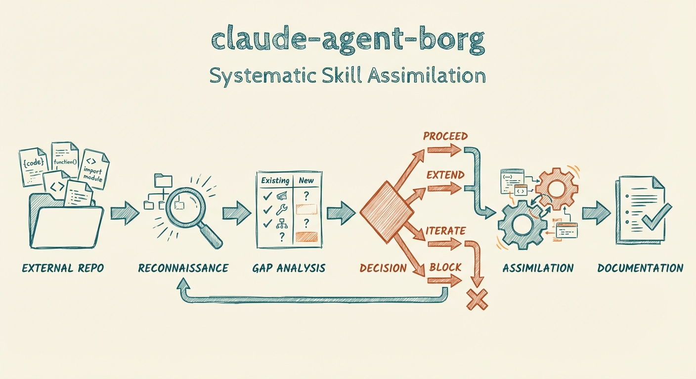

# Claude Agent Borg

[](https://opensource.org/licenses/MIT)
[](https://claude.ai)

*Resistance is futile. Your capabilities will be assimilated.*

A Claude Code agent that analyzes external Claude/Obsidian setups and integrates their best features into your system.



## Watch It In Action

[](https://youtu.be/zbiiZLaz660)

*Click to watch: Stop Copying Claude Code Skills Blindly*

## The Problem

You see someone's Claude Code setup online and think "I want that feature."

But copying and pasting creates problems:
- Their naming conventions don't match yours
- Their dependencies don't exist in your system
- You don't know what conflicts with your existing tools
- Manual adaptation is tedious and error-prone

This agent solves that.

## How It Works

The Borg agent runs a systematic 5-phase assimilation process:

| Phase | Action | What It Does |
|-------|--------|--------------|
| 1. Reconnaissance | Maps external system | Identifies skills, agents, workflows, dependencies |
| 2. Gap Analysis | Compares capabilities | Scores features by value, flags conflicts |
| 3. Adaptation Planning | Maps conventions | Converts external patterns to your standards |
| 4. Assimilation | Integrates features | Creates adapted artifacts in your system |
| 5. Documentation | Updates changelogs | Tracks what was absorbed and from where |

### Key Features

**Infrastructure Compatibility Check**
- Verifies all dependencies exist before porting
- Substitutes equivalent services automatically
- Flags missing requirements clearly

**Smart Assimilation Decisions**
- **PROCEED** - Genuinely new capability
- **EXTEND** - Add to existing artifact
- **COMPOSE** - Combine existing tools
- **ITERATE** - Extract pattern only
- **BLOCK** - Would create problematic duplication

**Convention Adaptation**
- Converts TitleCase to kebab-case
- Maps directory structures
- Adapts to your branding and aesthetic
- Preserves source attribution

## Installation

### Option 1: Copy to your Claude Code agents directory

```bash
# Clone the repository
git clone https://github.com/aplaceforallmystuff/claude-agent-borg.git

# Copy to your Claude Code agents directory
cp claude-agent-borg/agents/borg.md ~/.claude/agents/
```

### Option 2: Git submodule

```bash
# Add as submodule in your .claude directory
cd ~/.claude/agents
git submodule add https://github.com/aplaceforallmystuff/claude-agent-borg.git borg
ln -s borg/agents/borg.md borg.md
```

## Usage

### Analyze a local directory

```
Assimilate ~/path/to/external-claude-setup
```

The agent will:
1. Scan the external `.claude/` directory
2. Identify skills, agents, commands, hooks
3. Check dependencies against your infrastructure
4. Generate an assimilation report with recommendations

### Clone and analyze a GitHub repository

```
Clone and assimilate https://github.com/username/their-claude-setup
```

The agent will:
1. Clone the repository to a temporary location
2. Analyze its `.claude/` directory structure
3. Generate assimilation report with recommendations

### Absorb a specific feature

```
Borg: absorb the specific-skill from ~/path/to/external-system
```

### Compare systems

```
Compare my system with ~/path/to/external-setup and identify gaps
```

### Check assimilation history

```
What have we assimilated recently?
```

## Example Workflow

**Scenario:** You find a Claude setup on GitHub with interesting skills for generating image prompts.

```
User: Clone and assimilate https://github.com/example/awesome-claude-setup

Borg:
[Phase 1: Reconnaissance]
Cloning repository...
Scanning repository structure...

Found:
- 12 skills
- 8 agents
- 3 commands
- 2 hooks

[Phase 1.5: Infrastructure Check]
Checking dependencies...
✅ OpenAI API - available
✅ Anthropic API - available
⚠️  Replicate API - MISSING, will substitute with OpenAI DALL-E
❌ Custom MCP server "image-gen" - MISSING, will skip related features

[Phase 2: Gap Analysis]
HIGH VALUE Features:
- image-prompt skill (AI image prompt generation) - HIGH VALUE
  Adaptation: None of your skills handle image prompting

MEDIUM VALUE Features:
- research skill (parallel query spawning) - MEDIUM VALUE
  Note: You have 8 specialized librarian agents
  Recommendation: ITERATE - extract parallel pattern, don't replace agents

[Phase 3: Adaptation Planning]
image-prompt Skill:
- Source: /tmp/awesome-claude-setup/.claude/skills/image-prompt/
- Target: ~/.claude/skills/image-prompt/
- Adaptations needed:
  * Convert naming to your conventions
  * Replace Replicate API calls with OpenAI DALL-E
  * Adapt to your local infrastructure

Ready to assimilate? [Y/N]
```

## Configuration

The agent adapts to YOUR system's conventions. Common mappings:

| External | Your Standard |
|----------|---------------|
| `.claude/Skills/` | `~/.claude/skills/` |
| TitleCase dirs | lowercase dirs |
| `${EXTERNAL_VAR}` | Absolute paths |

You can customize convention mappings by editing the agent's `<convention_mappings>` section.

## Advanced: ITERATE Mode

When the external system has a generic version of something you've specialized, the agent can extract just the pattern:

**Example:**
- External: Generic "Research" skill that searches 5 sources in parallel
- Your system: 8 specialized librarian agents (tech, craft, security, etc.)
- **ITERATE decision**: Don't replace your agents. Instead, extract the "parallel spawn + query decomposition" pattern and apply it to YOUR agents.

This prevents losing your domain-specific implementations while still gaining valuable patterns.

## What Gets Tracked

Every assimilation updates `CHANGELOG-borg.md`:

```markdown
## [2026-01-07] Assimilation: Image Prompt Skill

**Source:** awesome-claude-setup
**Source URL:** https://github.com/example/awesome-claude-setup

### Added
- skill: image-prompt - AI image prompt generation

### Adapted
- Replaced Replicate with OpenAI DALL-E
- Converted naming conventions to local standards
- Adapted to local infrastructure

### Dependencies
- OpenAI API key required

### Usage
Run: `generate image prompt for [description]`
```

## Philosophy

**"Your culture adapts to service us"**

This means:
- External patterns get converted to YOUR conventions
- You don't adopt their naming, they adopt yours
- Infrastructure gaps are bridged or substituted
- The collective (your system) improves without losing identity

## Requirements

- Claude Code CLI
- Access to external `.claude/` directories you want to analyze
- Appropriate API keys for features you choose to assimilate

## License

MIT License - see [LICENSE](LICENSE) file for details.

## Author

Built by [Jim Christian](https://github.com/aplaceforallmystuff) as part of the Claude Code agent ecosystem.

## Acknowledgments

Inspired by the need to learn from the best setups without copying blindly. If you find a better way to do something, resistance is futile.

---

**Related Projects:**
- [claude-draft-reviewer](https://github.com/aplaceforallmystuff/claude-draft-reviewer) - Reviews AND fixes drafts
- [claude-think-first](https://github.com/aplaceforallmystuff/claude-think-first) - Mental models before implementation
- [claude-creation-guard](https://github.com/aplaceforallmystuff/claude-creation-guard) - Prevents duplicate artifacts
